# GPAA Database - Entity Relationship Diagram

This file contains the Entity Relationship Diagram for the GPAA database schema in Mermaid format.

**Important**: This website has **NO user authentication**. All visitors access content as guests. The `admin_users` table is for internal administrative use only and is not exposed to the public website.

## Core Entities Diagram

```mermaid
erDiagram
    %% Core Admin & Membership (No Public Authentication)
    admin_users ||--o{ members : "approves"
    admin_users ||--o{ audit_logs : "performs actions"
    
    membership_categories ||--o{ members : "categorizes"
    membership_categories ||--o{ membership_category_benefits : "includes"
    
    members ||--o{ event_registrations : "registers for"
    members ||--o{ program_enrollments : "enrolls in"
    members ||--o{ job_applications : "applies for"
    members ||--o{ volunteer_applications : "volunteers"
    members ||--o{ donations : "donates"
    members ||--o| executives : "serves as"
    
    %% News & Content
    news_categories ||--o{ news_articles : "categorizes"
    
    %% Events
    events ||--o{ event_registrations : "has registrations"
    
    %% Programs & CPD
    program_categories ||--o{ programs : "categorizes"
    programs ||--o{ program_enrollments : "has enrollments"
    
    %% Jobs & Careers
    job_postings ||--o{ job_applications : "receives applications"
    admin_users ||--o{ job_applications : "reviews"
    
    %% Volunteers
    volunteer_areas ||--o{ volunteer_applications : "receives applications"
    admin_users ||--o{ volunteer_applications : "reviews"
    
    %% Donations
    donation_campaigns ||--o{ donations : "collects"
    
    %% Leadership
    executive_positions ||--o{ executives : "defines"
    
    %% Resources
    resource_categories ||--o{ resources : "organizes"
    resource_categories ||--o{ resource_categories : "parent-child"
    
    %% Conferences
    conferences ||--o{ conference_materials : "archives"
    
    %% Communications
    admin_users ||--o{ contact_messages : "assigned to"
    email_templates ||--o{ email_logs : "used in"
    
    %% Settings
    admin_users ||--o{ site_settings : "updates"

    %% Entity Definitions
    admin_users {
        int id PK
        string name
        string email UK
        boolean is_active
        timestamp created_at
    }
    
    members {
        bigint id PK
        int category_id FK
        string first_name
        string last_name
        string license_number UK
        enum membership_status
        date membership_expiry_date
    }
    
    membership_categories {
        int id PK
        string title
        decimal fees
        boolean is_active
    }
    
    news_articles {
        bigint id PK
        int category_id FK
        string title
        string slug UK
        text content
        enum status
        timestamp published_at
    }
    
    events {
        bigint id PK
        string title
        date event_date
        string location
        enum type
        enum status
    }
    
    programs {
        bigint id PK
        int category_id FK
        string title
        decimal cpd_hours
        enum status
    }
    
    job_postings {
        bigint id PK
        string title
        enum type
        string location
        enum status
        date application_deadline
    }
    
    donations {
        bigint id PK
        int campaign_id FK
        bigint member_id FK
        decimal amount
        enum donation_type
        enum payment_status
    }
```

## Detailed Relationships

### Admin Management (Internal Only)
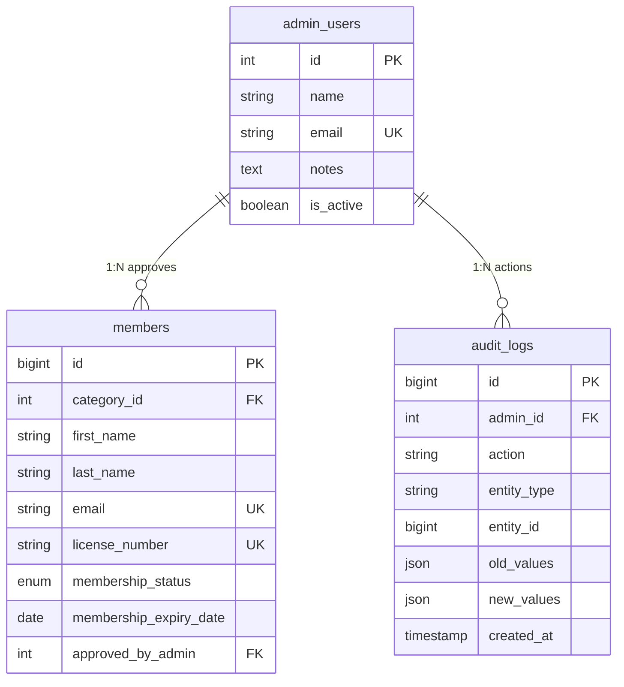

### Membership Structure
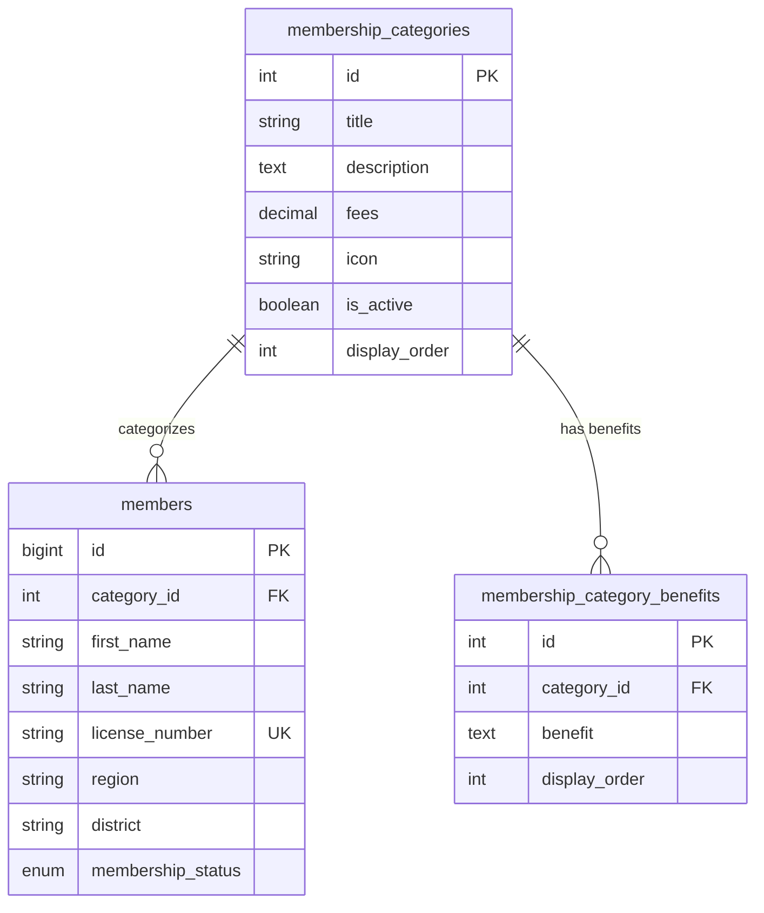

### News & Content Management
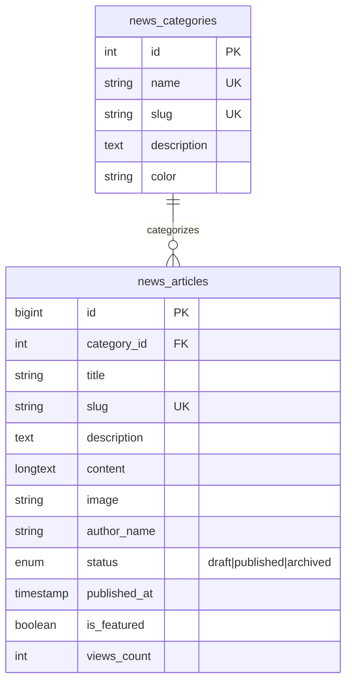

### Events & Registrations
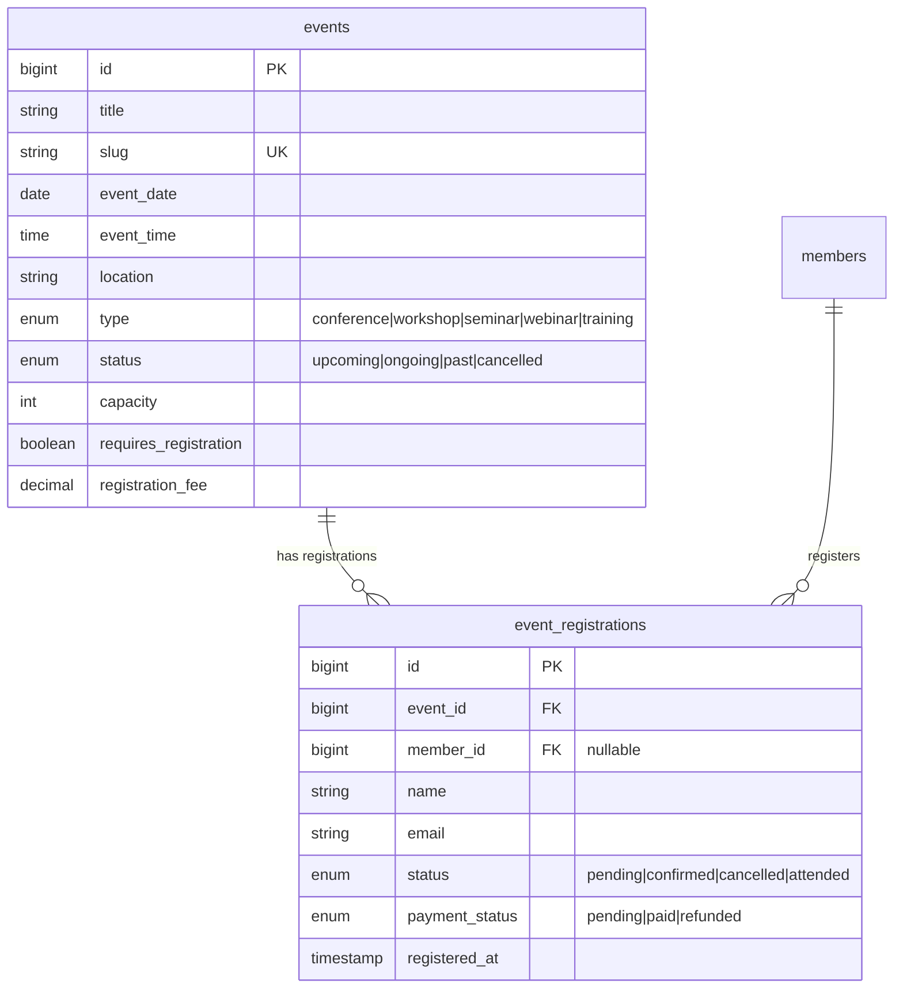

### Programs & CPD Tracking
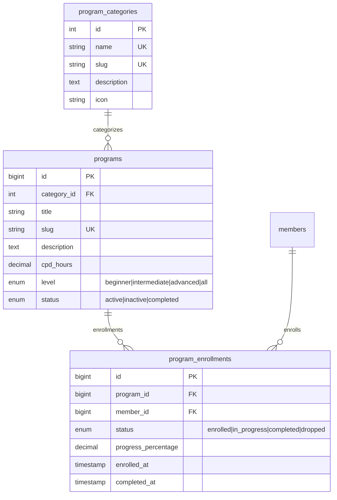

### Recruitment System
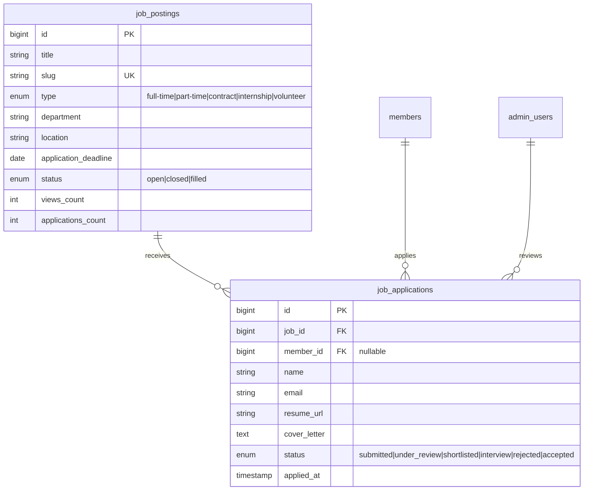

### Volunteer Management
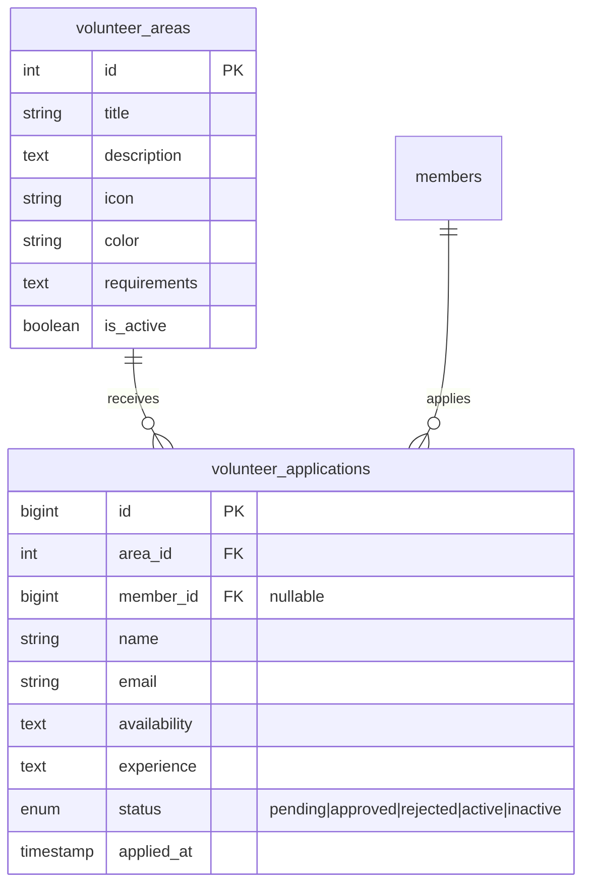

### Donation & Fundraising
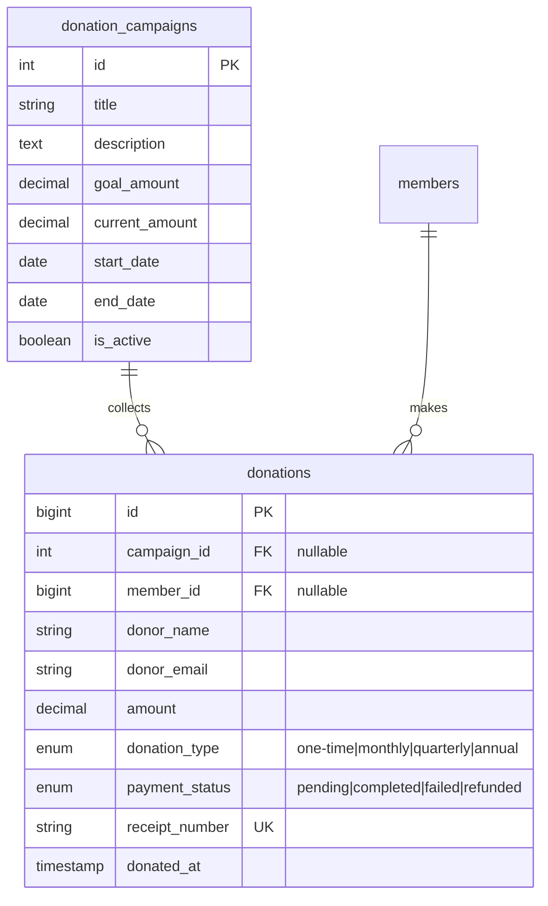

### Leadership Structure
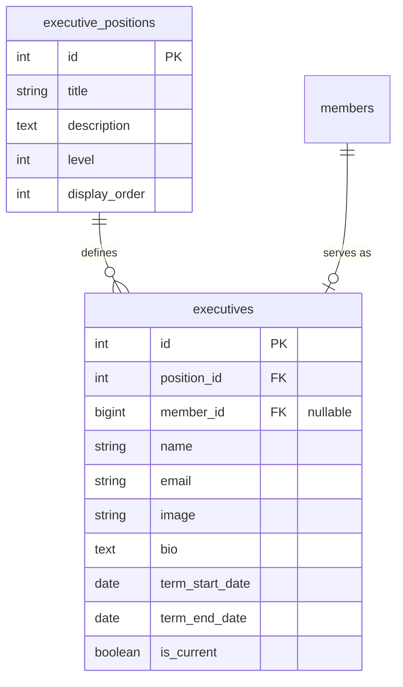

### Resource Library
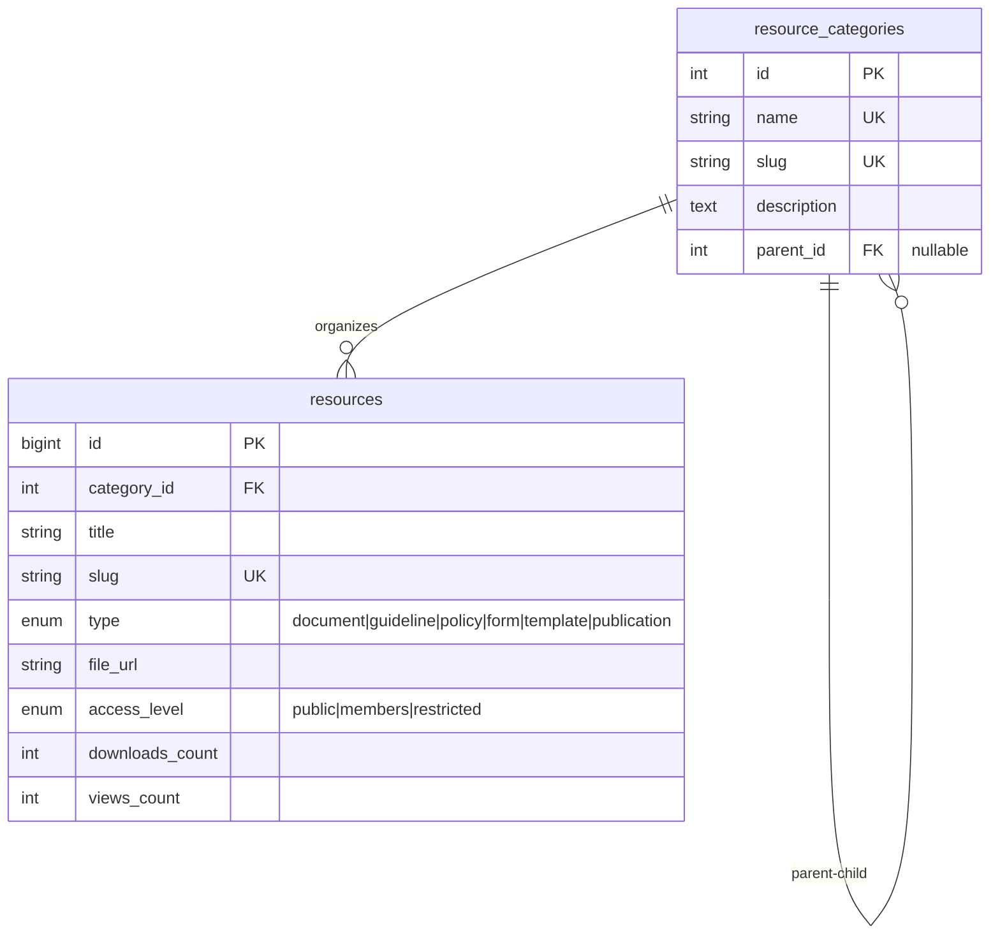

### Conference Archives
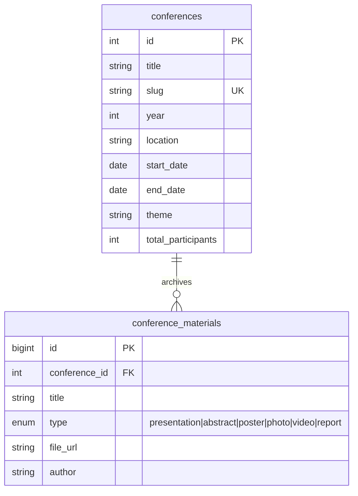

### Communication System
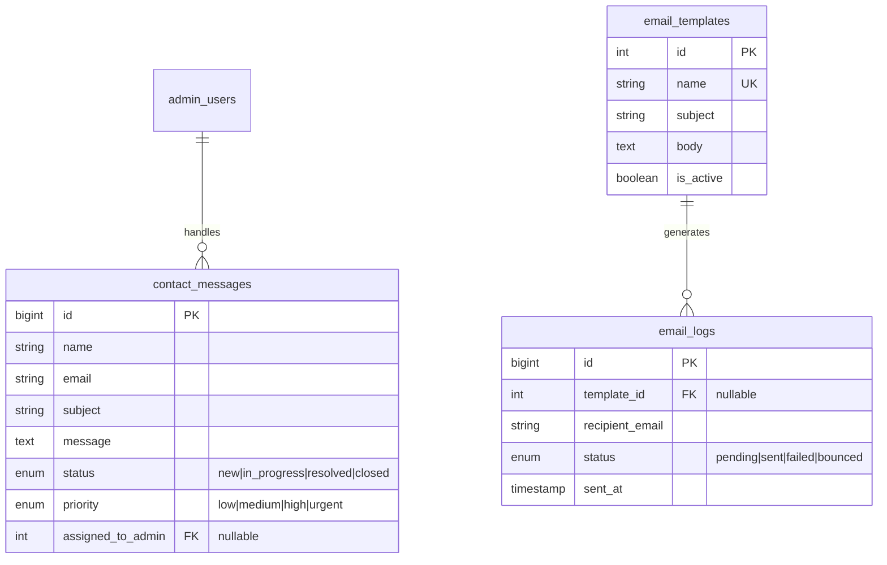

**Note**: No in-app notifications - all communication via email since there's no user authentication system.

## Database Statistics

### Estimated Table Sizes (after 5 years)

| Table | Estimated Rows | Growth Rate |
|-------|----------------|-------------|
| admin_users | 10-20 | Internal staff only |
| members | 5,000 | 1,000/year |
| news_articles | 1,000 | 200/year |
| events | 500 | 100/year |
| event_registrations | 25,000 | 5,000/year |
| programs | 100 | 20/year |
| program_enrollments | 50,000 | 10,000/year |
| job_postings | 200 | 40/year |
| job_applications | 2,000 | 400/year |
| contact_messages | 5,000 | 1,000/year |
| donations | 10,000 | 2,000/year |
| audit_logs | 500,000 | 100,000/year |

**Note**: Without user authentication system, reduced overhead in user management and session tracking.

## Implementation Notes

1. **Indexing**: All foreign keys are indexed for optimal join performance
2. **Full-Text Search**: Implemented on title/description fields for search functionality
3. **No Authentication**: Simplified architecture without password management or session handling
4. **Email-Based Communication**: All notifications sent via email
5. **Archiving**: Implement archiving strategy for old audit logs and completed events
6. **Partitioning**: Consider partitioning audit_logs by date for better performance
7. **Caching**: Implement application-level caching for frequently accessed data
8. **GDPR Compliance**: Ensure data collection forms comply with privacy regulations

## Visual Tools

To visualize this ERD:
1. Copy the Mermaid code blocks
2. Paste into [Mermaid Live Editor](https://mermaid.live/)
3. Export as PNG/SVG for documentation

Or use VS Code extensions:
- Markdown Preview Mermaid Support
- Mermaid Markdown Syntax Highlighting
